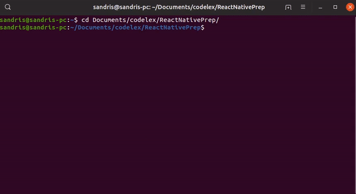
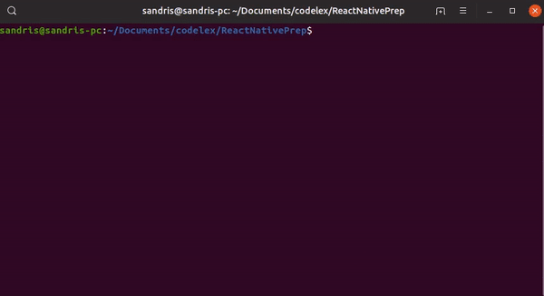
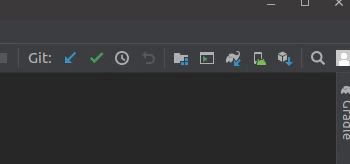
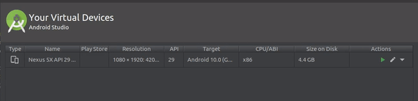
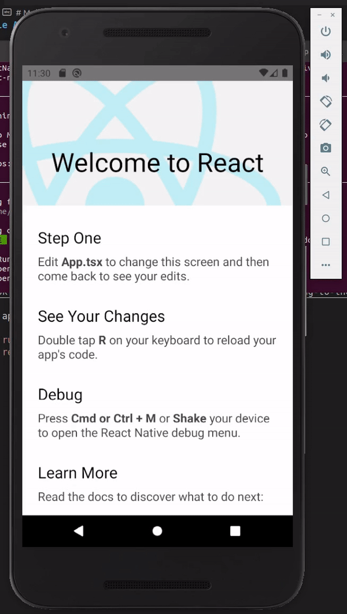

# React Native Prep

Mac is required to build for iOS, but Android development can be done on Mac, Windows or Linux.

We are going to develop an app using Android emulator on your computer, if you really want you can:

- use a real Android device connected to your computer with a cable
- use iPhone emulator / real device (Mac is required)

## Environment Setup

 - We are going to write code using [Visual Studio Code](https://code.visualstudio.com)
 - Latest stable version of `node` must be installed, check the version using `node -v`. Download latest stable version [@nodejs.org](https://nodejs.org/en) if needed. If you have conflicting versions on your local machine and you cannot start the app, try using [Node Version Manager](https://github.com/nvm-sh/nvm) to switch between versions.

### Environment Setup for Android

- Make sure you have Java 8 (aka Java 1.8) installed by executing `java -version`. Installation instructions:
    - [Ubuntu / Mint](https://tecadmin.net/install-oracle-java-8-ubuntu-via-ppa)
    - [Linux / Windows / Mac](https://www3.ntu.edu.sg/home/ehchua/programming/howto/JDK_Howto.html)
- Check that you have `JAVA_HOME` environment variable set to Java 8 location
    - Ubuntu [this](https://stackoverflow.com/questions/9612941/how-to-set-java-environment-path-in-ubuntu/18972665) or [this](https://askubuntu.com/questions/175514/how-to-set-java-home-for-java)
    - [Windows](https://confluence.atlassian.com/doc/setting-the-java_home-variable-in-windows-8895.html)
    - [Mac](https://mkyong.com/java/how-to-set-java_home-environment-variable-on-mac-os-x/)
- [Android Studio](https://developer.android.com/studio/install), make sure that you download *Android Virtual Device*
- You will need to accept all the licences, _SDK_ is probably somewhere in your home folder and there will be instructions on the first launch

### Environment Setup for iOS

Please refer to the official documentation [@facebook.github.io](https://facebook.github.io/react-native/docs/running-on-simulator-ios) or tutorial [@egghead.io](https://egghead.io/lessons/react-native-create-a-react-native-app-and-run-it-on-the-ios-simulator-and-android-emulator).

## Running an Application

`npm run start` in you project root directory, this command starts a JS server:

**NB!** DO NOT close this terminal session

`npx react-native run-android` or `npx react-native run-ios`, in your project root directory, this command starts the app on your phone / emulator

## Running an Application on Android

**NB!** We are NOT using Expo!

Go through the [offical documentation @facebook.github.io](https://facebook.github.io/react-native/docs/getting-started.html#android-development-environment).

Open Android Studio and launch AVD manager from the top-right corner:

Select the device and launch it:

**NB!** When an emulator opens, you can close Android Studio to save resources on you computer.

If everything went well you should see a working application:

That is it for now, it is recommended to follow the instructions on the screen and get familiar with the mentioned resources.

## Troubleshooting

**SDK location not found. Define location with an ANDROID_SDK_ROOT environment variable or by setting the sdk.dir path in your project's local properties file...**

Create a file called _local.properties_ in the _android/app_ directory.

Find Android Sdk location, on Linux it should be in your home folder.

Add single line in the file:

> sdk.dir=/home/{your-user-name}/Android/Sdk